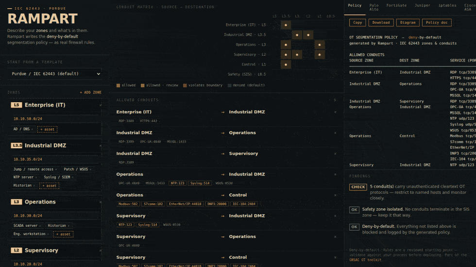
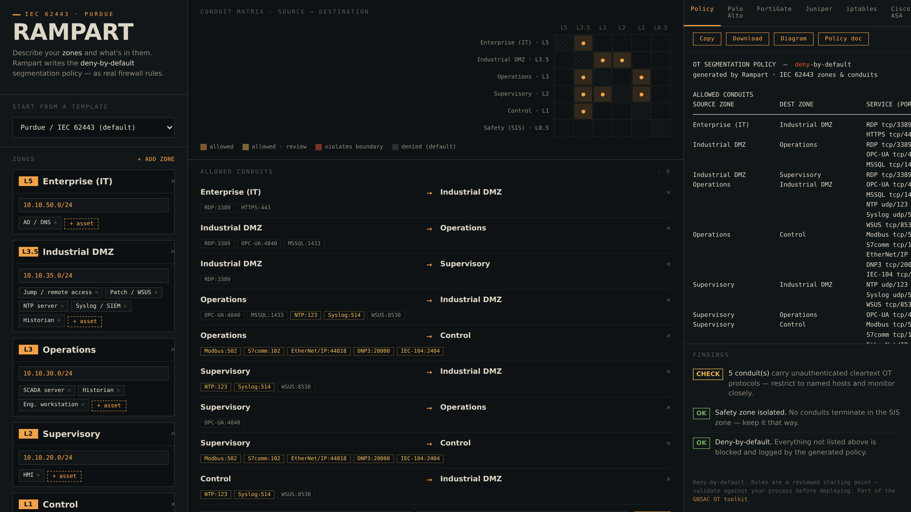

# 🧱 RAMPART



### Describe your OT zones. Get a deny-by-default segmentation policy — as real firewall rules.

**[▶ Open Rampart](https://bariskececi.github.io/rampart/)** · no install, nothing is uploaded, runs entirely in your browser.

<!-- drag rampart_demo.gif in here -->

Network segmentation is the single most effective control in OT security — and the
one teams get stuck on. Everyone knows they *should* separate IT from OT and follow
the Purdue model; far fewer can turn "here are my zones and what's in them" into a
correct, deny-by-default ruleset they can actually deploy.

Rampart does exactly that. You lay out your zones (it starts from a Purdue /
IEC 62443 template), drop in what each one contains — PLCs, HMIs, SCADA, historian,
jump host, safety PLC — and it **derives the conduits your assets actually need**,
checks them against zone-and-conduit boundary rules, and writes the policy out as:

- a readable **conduit matrix**,
- **Palo Alto** security rules (with named address & service objects),
- **FortiGate** policy,
- **Juniper SRX** policy,
- **iptables**,
- **Cisco ASA** access-lists,
- and a portable **JSON** model.

Deny-by-default, with every allowed flow scoped to a source, destination, protocol
and port. Copy it, download it, take it into your change process.

## More than a rule generator



- **Industry templates** — start from a Water/Wastewater, Power substation,
  Manufacturing or Building-automation layout, or the plain Purdue/62443 default.
- **Import your inventory** — paste or drop a CSV of `ip,type[,zone]` (e.g. an
  export from an asset-discovery pass) and Rampart drops each device into the right
  zone by subnet, then derives the policy. Anything it can't place lands in a
  *Discovered* zone for you to sort.
- **Downloadable diagram** — a clean Purdue-stack **SVG** of your zones and
  conduits, for docs and audits.
- **Printable policy document** — a formatted *OT Network Segmentation Policy* with
  the zone table, conduit table, findings and **IEC 62443-3-3** references (SR 5.1,
  5.2, 5.3, 7.6) — print or save to PDF for your change process.
- **Save & share** — export the whole model as JSON, or grab a **share link** that
  encodes the design in the URL so a colleague opens exactly what you see. Nothing
  is stored on a server; the link carries the data.

## Why this is different from "how to segment OT" articles

An article explains the theory. Rampart produces **your** policy for **your** zones
and subnets — the specific rules, in your firewall's syntax, in ten seconds. And it
tells you when something's wrong:

- IT talking straight to control instead of terminating in the DMZ → flagged.
- A conduit that skips a Purdue level → flagged.
- Anything reaching the safety (SIS) zone → flagged.
- Unauthenticated cleartext OT protocols crossing a boundary → flagged.

## What it checks (IEC 62443 zones & conduits + Purdue)

| Rule | Rampart's behaviour |
|------|--------------------|
| IT ↔ OT must pass through the Industrial DMZ (L3.5) | Direct L4/5 ↔ L1/2/3 conduits raised as violations |
| No skipping Purdue levels | Multi-level conduits flagged for a broker/replica |
| Safety zone stays isolated | Any inbound conduit to the SIS zone flagged |
| Least privilege | Only the services an asset actually needs are permitted |
| Deny-by-default | Everything not explicitly allowed is dropped and logged |

## Private by design

Everything runs in the browser. Your zone names, subnets and architecture never
leave the page — no backend, no upload, no tracking. Open `index.html` on an
air-gapped laptop if you like.

```bash
open index.html            # macOS
xdg-open index.html        # Linux
python3 -m http.server 8080   # or serve it → http://localhost:8080
```

## Scope

Rampart writes a **reviewed starting point**, not a finished firewall config. It
encodes segmentation best practice; you still validate every rule against your
process, your addressing and your vendor's specifics before deploying. For a full
architecture review, that's what the rest of the GNSAC OT toolkit — and a human — is
for.

## License

MIT — see [LICENSE](LICENSE). Part of the GNSAC OT security toolkit.
